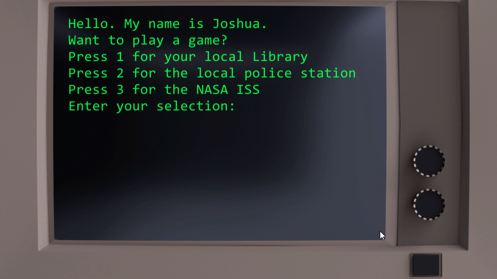
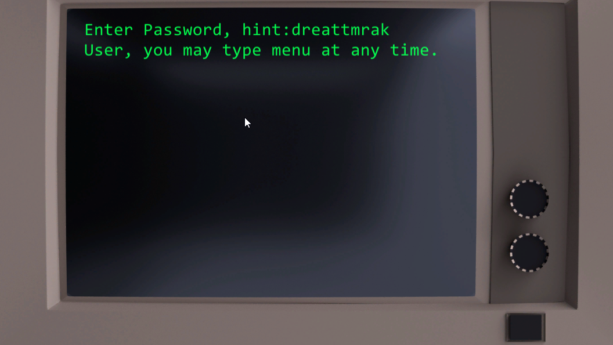

# Terminal Hacker

A simple C# Unity game. Hack one of three institutes and get a reward for guessing right.




## Play my game!
* [Terminal Hacker](https://sharemygame.com/@samkuttenk/hackergame)

## Technologies Used

* [Unity](https://unity.com/)
* [C#](https://docs.microsoft.com/en-us/dotnet/csharp/)


## Code Snippets

Game config and state and game start.

```csharp
 public class Hacker : MonoBehaviour
{
    #region GameConfigAndState
    //Game config
    const string menuHint = "User, you may type menu at any time.";
    string[] level1Passwords = {"books", "checkout", "librarian"};
    string[] level2Passwords = {"prisoner", "handcuffs", "officer","donut","arrest"};
    string[] level3Passwords = {"spacewalk", "darkmatter", "gravity","propulsion","spacestation", "astronaught"};
    // Game State
    int level;
    string password;
    //Screen enumeration
    enum Screen { MainMenu, Password, Win };
    Screen currentScreen;
    #endregion
    #region Start

    void Start()
    {
        ShowMainMenu();
    }
    #endregion
    #region ShowMainMenu
        void ShowMainMenu()
        {
            currentScreen = Screen.MainMenu;
            Terminal.ClearScreen();
            Terminal.WriteLine("Hello. My name is Joshua.");
            Terminal.WriteLine("Want to play a game?");
            Terminal.WriteLine("Press 1 for your local Library");
            Terminal.WriteLine("Press 2 for the local police station");
            Terminal.WriteLine("Press 3 for the NASA ISS");
            Terminal.WriteLine("Enter your selection:");   
        }
    #endregion
  ```

Giving player hint, setting random password, and then checking password.
  ```csharp
  #region AskForPassword
        void AskForPassword()
        {
            currentScreen = Screen.Password;
            Terminal.ClearScreen();
            SetRandomPassword();
            Terminal.WriteLine("Enter Password, hint:" + password.Anagram());
            Terminal.WriteLine(menuHint);
        } 
    #endregion
    #region SetRandomPassword
        void SetRandomPassword()
        {
            switch(level)
            {
                case 1:
                    password = level1Passwords[Random.Range(0, level1Passwords.Length)];
                    break;
                case 2:
                    password = level2Passwords[Random.Range(0, level2Passwords.Length)];
                    break;
                case 3:
                    password = level3Passwords[Random.Range(0, level3Passwords.Length)];
                    break;
                default:
                    Debug.LogError("Invalid number");
                    break;
            }
        }
    #endregion
    #region CheckPassword
        void CheckPassword(string input)
        {
            if ( input == password )
            {
                DisplayWinScreen();
            }
            else
            {
                Terminal.WriteLine("Wrong Password");
            }
        }
    #endregion
  ```

# Author
  * Sam Kuttenkuler
    - [Github](https://www.github.com/skuttenkuler)
    - [LinkedIn](https://www.linkedin.com/in/skdev91)
